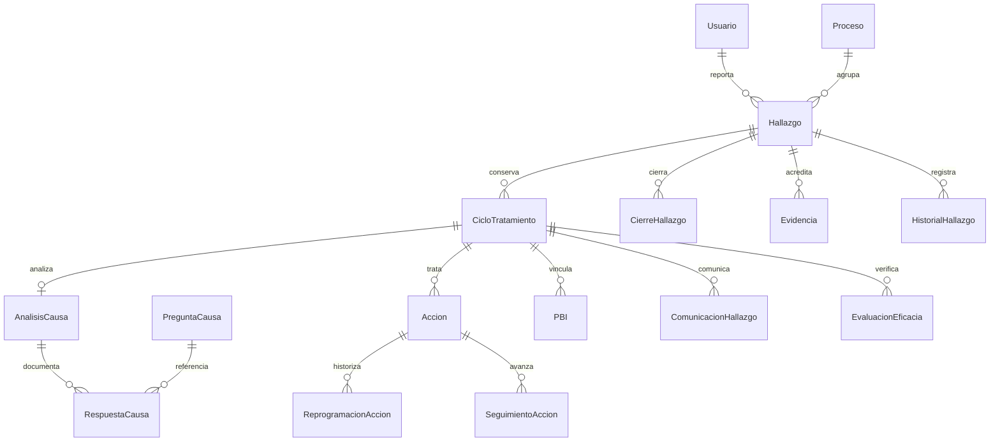

> Registro de la implementación inicial. La estructura vigente y su validación se describen en [ESTRUCTURA_SIMPLIFICADA.md](ESTRUCTURA_SIMPLIFICADA.md); esa actualización reemplaza las referencias a tablas que se consolidaron.

# Trazabilidad de requisitos

Esta matriz registra la implementación local. Las aprobaciones de negocio pendientes se mantienen en ASSUMPTIONS.md; no se confunden con pruebas técnicas.

| Requisito | Implementación | Verificación |
|---|---|---|
| Django + PostgreSQL, Custom User | config/settings.py, accounts/models.py, migraciones iniciales | migrate, check, suite sobre PostgreSQL |
| Diseño v8, login, SVG | portal-v8.css, includes/arte_*.html, base y registration/login | Revisión en navegador a 1366 y tablet 768; pruebas HTTP |
| Roles múltiples, separación admin/calidad | accounts/permissions.py, semilla grupos, Proceso.validadores | test_roles_y_aislamiento, test_no_autovalidacion_multirrol |
| Registro, borrador, envío | HallazgoForm, HallazgoService, WorkflowService | test_post_registro_no_acepta_estado_sac_del_cliente |
| SAC concurrente e inmutable | CodigoSACService, CorrelativoSAC UNIQUE, transaction/lock | test_postgresql_reserva_concurrente_sac, test_sac_unico_y_tipo_inmutable |
| Fechas e impacto | validar_datos, ImpactoService | test_fecha_impacto_prioridad_y_na |
| Prioridad configurable | MatrizPrioridad, PrioridadService | falta de combinación activa bloquea y registra warning |
| Devolución, corrección y validación | WorkflowService, version del hallazgo | test_devolucion_correccion_y_reenvio, test_version_y_atomicidad |
| No crítica: corrección/comunicación/verificación | Accion, ComunicacionHallazgo, guards | test_no_critica_recorrido_completo, test_no_saltos_ni_cierre_sin_eficacia_comunicacion |
| Crítica: 6M y PBI si tecnológica | AnalisisCausa, RespuestaCausa, ControlProceso, PBI | test_critica_tecnologica_exige_6m_pbi_y_correctivas |
| 32 preguntas preservadas, snapshots | preguntas_6m.json, seed, checklist_snapshot | test_control_6m_obligatorio_y_snapshot, test_semillas_idempotentes |
| Acciones 1:N, seguimiento, reprogramación | AccionService + modelos normalizados | test_reprogramaciones_maximo_y_fet_inmutable |
| Eficacia, cierre y reapertura | EficaciaService, CierreHallazgo, CicloTratamiento | test_no_eficaz_preserva_ciclo_y_reabre, test_reapertura_manual_no_borra_cierre |
| Evidencias privadas y validadas | EvidenciaService + descarga con autorización | test_archivos_y_descarga_privada |
| Búsqueda, paginación, seguimiento | selectors, views, filtros GET y detalle | test_login_csrf_y_urls_por_rol, test_pantallas_de_tratamiento_y_post_transicion |
| Administrador propio | catalogos/forms/views y templates/administrador | test_administracion_catalogo_y_ultimo_admin |
| Notificaciones internas y vencimientos | Notificacion + comando notificar_vencimientos | test_avisos_vencimiento_idempotentes |
| Atomicidad y validación simultánea | orden de locks caso → acción, transaction.atomic | test_version_y_atomicidad, test_validacion_simultanea_es_una_sola_transicion |
| CSRF, POST, permisos de objeto, escape | middleware Django + services + templates | test_login_csrf_y_urls_por_rol, test_no_edicion_ajena_http_y_xss |
| Informes y CSV | catalogos/views.reportes, indicadores ORM | acceso por rol; definiciones explícitas en README |

## Entidades principales

## Límites declarados

Integraciones externas sin implementar por instrucción. Falta aprobación oficial de la matriz y documentos señalados. Evidencias de cierre se incorporan al expediente antes de cerrar; no se habilita modificar un caso ya cerrado. El modelo admite referencias a cierre para futura operación documental controlada. No se implementan cancelación de acciones ni reclasificación posterior a la validación sin regla aprobada.
